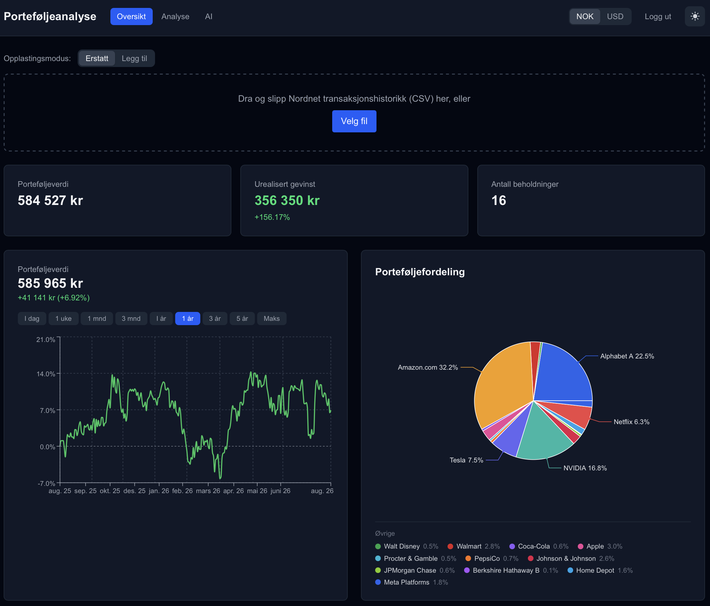
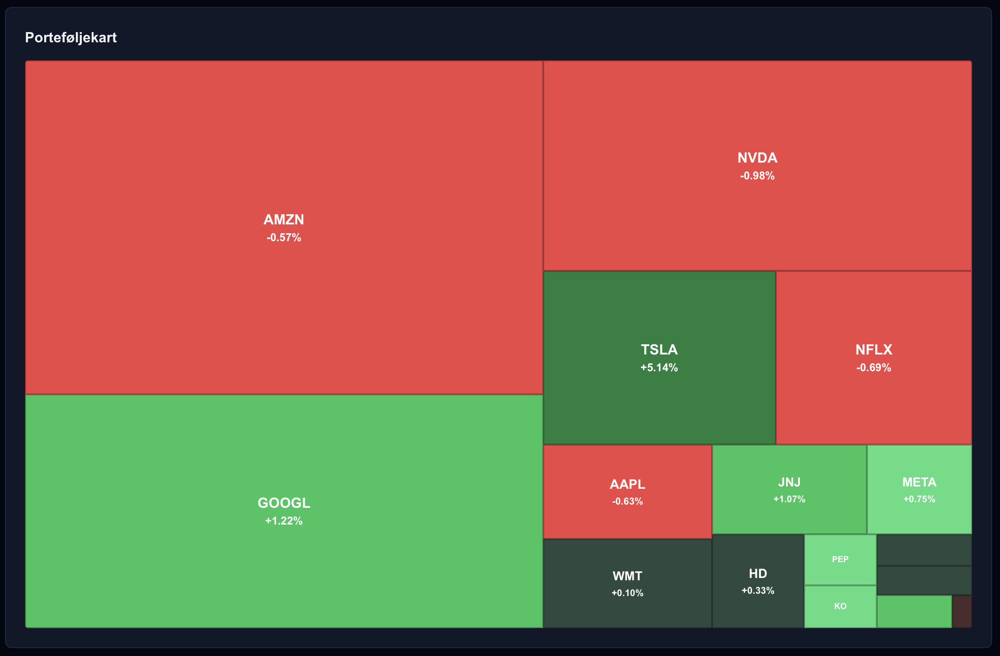
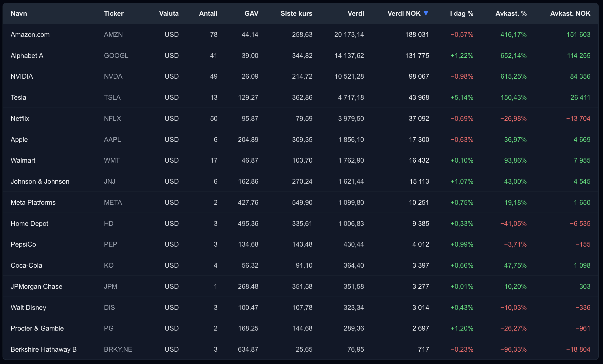
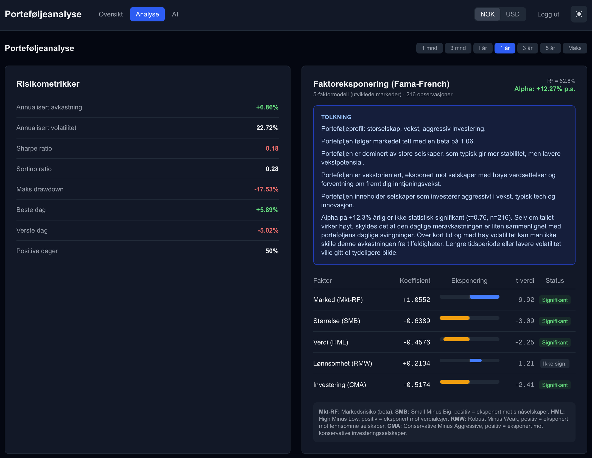
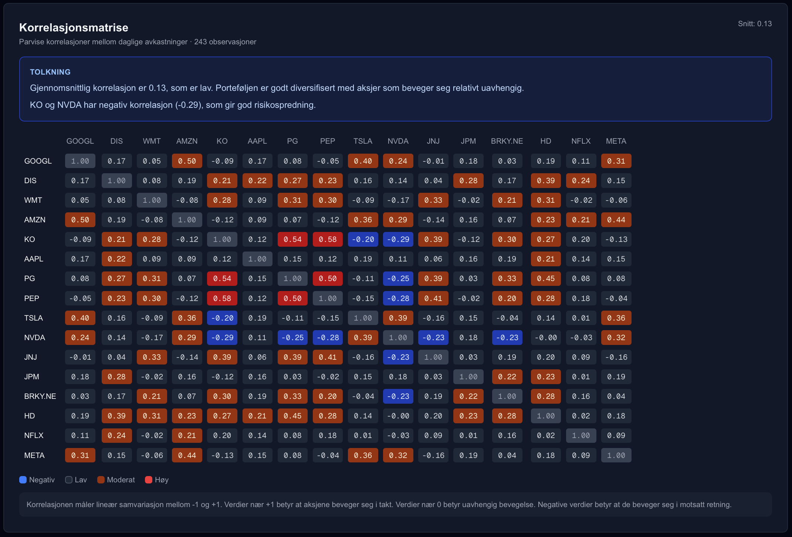
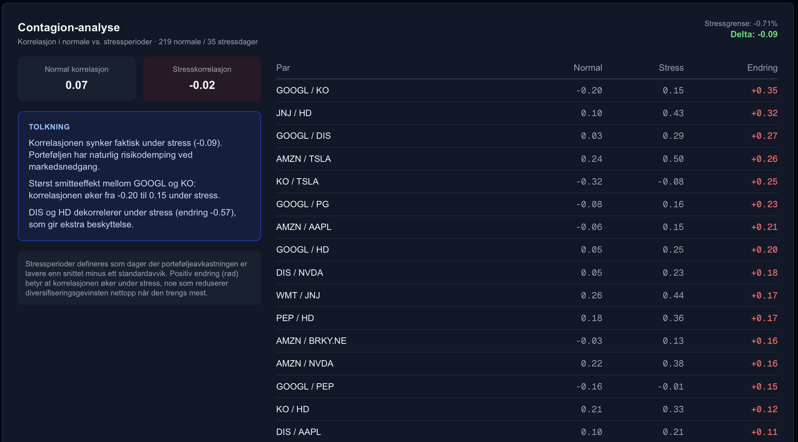
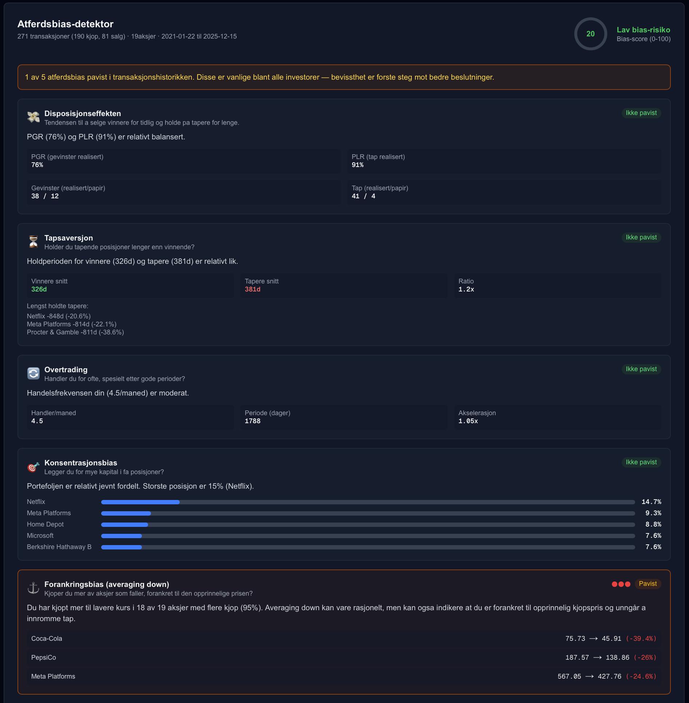
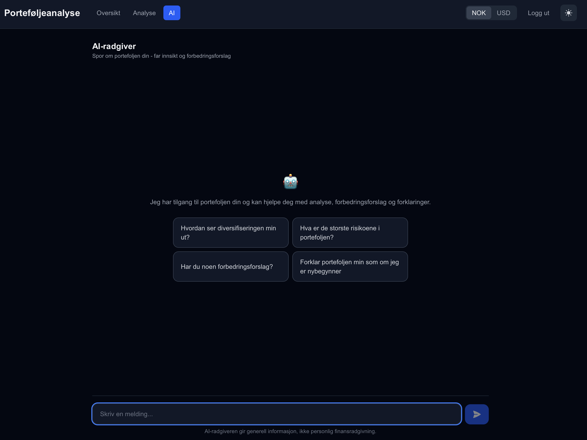

# Porteføljeanalyse — Portfolio Analytics

A full-stack portfolio analytics app for Nordnet investors. Upload your Nordnet
transaction history and get a live dashboard, quant-grade risk & factor analysis,
a behavioral-bias audit of your trading, and an AI advisor that can answer
questions about your own portfolio.

> The user interface is in Norwegian. Prices are fetched live and can be shown in
> **NOK** or **USD**, with a light/dark theme toggle.

<p align="center">
  
</p>

---

## Table of contents

- [Features](#features)
  - [Overview dashboard](#overview-dashboard)
  - [Analysis](#analysis)
  - [AI advisor](#ai-advisor)
- [Tech stack](#tech-stack)
- [Getting started](#getting-started)
- [Uploading your data](#uploading-your-data)
- [Project structure](#project-structure)
- [Disclaimer](#disclaimer)

---

## Features

### Overview dashboard

Drop in a Nordnet transaction-history CSV (**replace** or **append** mode) and the
app derives your current holdings from the raw transactions, enriches them with
live market prices, and converts everything to your chosen currency.

- **Key figures** — total portfolio value, unrealized gain (absolute and %), and
  number of holdings.
- **Value over time** — a time-weighted return chart with selectable ranges
  (today, 1 week, 1/3 months, 1/3/5 years, max).
- **Allocation pie** (*Porteføljefordeling*) — share of each holding, with the
  largest slices labelled directly and the smaller ones collected in an
  *Øvrige* legend below.

<p align="center">
  
</p>

- **Portfolio heatmap** (*Porteføljekart*) — a treemap sized by position value and
  colored by today's move (green up / red down), so you can see at a glance what's
  driving the day.

<p align="center">
  
</p>

- **Holdings table** — per position: quantity, average cost (GAV), last price,
  native value, value in NOK, today's %, total return % and total return in NOK.

<p align="center">
  
</p>

### Analysis

The **Analyse** tab runs a suite of quantitative analytics over your portfolio's
daily returns, each with a plain-language interpretation. All views share a
time-period selector (1 month → max).

**Risk metrics & factor exposure** — annualized return and volatility, Sharpe and
Sortino ratios, max drawdown, best/worst day and share of positive days; alongside
a **Fama–French 5-factor** regression (market, size, value, profitability,
investment) with each factor's coefficient, t-value and significance, plus alpha
and R².

<p align="center">
  
</p>

**Correlation matrix** — pairwise correlations between every holding's daily
returns, color-coded from negative to high, with the portfolio's average
correlation as a quick diversification read.

<p align="center">
  
</p>

**Contagion analysis** — compares correlations in normal vs. stress periods
(days when the portfolio return is well below average) to reveal which pairs
move together precisely when diversification matters most.

<p align="center">
  
</p>

**Behavioral-bias detector** (*Atferdsbias-detektor*) — audits your actual
transaction history for five common biases and produces a bias score:
disposition effect, loss aversion, overtrading, concentration bias, and
anchoring / averaging-down.

<p align="center">
  
</p>

### AI advisor

The **AI** tab is a chat assistant (powered by Anthropic's Claude) that has your
portfolio context and can explain your diversification, flag the biggest risks,
suggest improvements, or break things down for a beginner.

<p align="center">
  
</p>

---

## Tech stack

**Frontend**
- [Next.js 16](https://nextjs.org/) + React 19 (TypeScript)
- [Tailwind CSS](https://tailwindcss.com/) for styling
- [Recharts](https://recharts.org/) for charts, `react-markdown` for AI responses

**Backend**
- [FastAPI](https://fastapi.tiangolo.com/) + [Uvicorn](https://www.uvicorn.org/)
- [SQLAlchemy](https://www.sqlalchemy.org/) over **PostgreSQL** (works with [Supabase](https://supabase.com/))
- [yfinance](https://github.com/ranaroussi/yfinance) for live prices, [pandas](https://pandas.pydata.org/) + [statsmodels](https://www.statsmodels.org/) for the analytics
- [Anthropic](https://www.anthropic.com/) Claude (`claude-haiku-4-5`) for the AI advisor
- JWT auth (`python-jose`) with `bcrypt` password hashing

---

## Getting started

### Prerequisites

- Python 3.13
- Node.js 18+
- A PostgreSQL database (local, or a free [Supabase](https://supabase.com/) project)
- An [Anthropic API key](https://console.anthropic.com/) (for the AI tab)

### 1. Backend

```bash
cd backend
python -m venv .venv
source .venv/bin/activate
pip install -r requirements.txt
```

Copy the example env file and fill in your own values:

```bash
cp .env.example .env
```

`backend/.env`:

```
DATABASE_URL=postgresql+psycopg://<user>:<password>@<host>:5432/<database>
ANTHROPIC_API_KEY=sk-ant-...
JWT_SECRET_KEY=<a long random string>
```

> - Using Supabase? Grab the **Session pooler** connection string from
>   *Connect → Session pooler* and change the scheme to `postgresql+psycopg://`.
> - Generate a `JWT_SECRET_KEY` with
>   `python -c "import secrets; print(secrets.token_urlsafe(48))"`. It signs your
>   login tokens — set a real value before deploying anywhere public.

Run it (tables are created automatically on startup):

```bash
uvicorn app.main:app --reload
```

The API is now on `http://localhost:8000`.

### 2. Frontend

```bash
cd frontend
npm install
```

Copy the example env file:

```bash
cp .env.example .env.local
```

`frontend/.env.local`:

```
NEXT_PUBLIC_API_URL=http://localhost:8000
```

Run it:

```bash
npm run dev
```

Open **http://localhost:3000**. The frontend proxies `/api/*` to the backend
(see `frontend/next.config.ts`), so both need to be running.

---

## Uploading your data

1. In Nordnet, export your **transaction history** as CSV (a tab-separated,
   UTF-16 file).
2. On the **Oversikt** tab, drag the file into the upload area (or click
   *Velg fil*). Choose **Erstatt** to replace everything or **Legg til** to
   append new transactions (duplicates are skipped per account).
3. Holdings, charts and analytics are derived from the transactions — there's no
   manual entry.

Want to try it without your own data? A generic sample file with fictional
transactions across well-known US stocks lives at
[`backend/sample_data/transactions-template.csv`](backend/sample_data/transactions-template.csv).

---

## Project structure

```
backend/
  app/
    routers/       # portfolio upload, analysis (risk/factors/correlation/
                   #   contagion/behavioral), ai_chat, auth
    services/      # Nordnet CSV parser, behavioral analysis, pricing helpers
    models/        # SQLAlchemy models (User, Transaction, ...)
    schemas/       # Pydantic schemas
    database.py    # engine / session
    main.py        # FastAPI app + table creation
  sample_data/     # generic sample transaction CSV
frontend/
  src/
    app/           # Next.js routes: overview, analysis, ai, login
    components/    # charts & cards (AllocationPie, PortfolioTreemap,
                   #   FactorExposureCard, CorrelationMatrixCard, ...)
    lib/api.ts     # typed API client
imgs/              # screenshots used in this README
```

---

## Disclaimer

This project is for educational and informational purposes only. The AI advisor
provides general information, **not** personal financial advice. Nothing here is a
recommendation to buy or sell any security.
